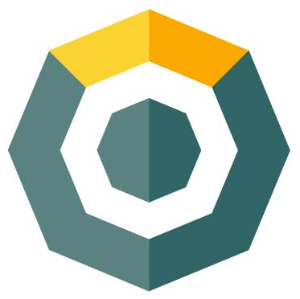

# Infotech-AL 2019KMD-NN-Elections - Back for season 3

## KMD NOTARY NODE CANDIDATE

###### KMD / NN NA

- InfoTech – Al

- 15 - year IT Veteran

- Candidate to be a NA Notary Node

### WHY VOTE FOR INFOTECH – AL

:ballot_box_with_check: Engaged community member for KMD on SLACK / Telegram / Twitter / Reddit

:ballot_box_with_check: Skills: Grid Computing Admin, Distributed Systems Exp., VMware Admin, Server Admin

:ballot_box_with_check: __Notary Node already setup__ and hosted in a reliable state of the art Data Center in USA.

:ballot_box_with_check: ***10% of all earnings on a monthly basis go back to voters and KMD platform!***

:ballot_box_with_check: All social media accounts have been changed to reflect KMD
- FB / Reddit / [Twitter](https://twitter.com/CryptoLova) / Telegram – All are Komodo themed! I’m all in!

 
	
 

`InfoTech – Al Notary Node Candidate` 

You get a Notary Node Operator, Social Media Marketer, World Traveler, Philanthropist, Bicyclist...

**VOTING DETAILS** :   RC6TuDXckmHqS85gF1JbLi9pPRD3oEWmiT 

> A vote for me, is a vote for full time Komodo representative!

# About Me

15 - year veteran in IT enterprise from small business to international investment banks. Worked on grid computing systems, VMware, trading platform, architect and manage multi-million-dollar budgets for large corporations.

# More About Me

I have been following the crypto space since 2013. I bought my first bitcoin in 2015 and haven’t looked back...

I setup a mining rig, I setup some master nodes, I made a little money on BTC/ETH/LTC holdings, sold at the peak in DEC 2017 now I am looking to throw myself behind another promising platform for 2018!

I **know** the Komodo team will be successful and that is why I want to be part of this enterprise!

### Server Info: Hardware

Bare Metal Dedicated Server (MaaS)

| Specs | Details |
|--|--|
| OS | Ubuntu 16. 04 .3 LTS |
| CPU | Intel Xeon E5-1620 v |
| SSD | 500GB |
| Memory | 64 GB |
|Transfer | 10000 |

# FAQ

- [What will you do for Komodo the coin, Komodo platform?](#what-will-you-do-for-komodo-the-coin-komodo-platform)
- [What will you offer back?](#what-will-you-offer-back)

## What will you do for Komodo the coin, Komodo platform?

My experience is in distributed systems, grid services, QA, Windows / Linux
servers. I cannot link my professional profile because it would be against company
policy. However, I assure you I am dedicated to KMD success as a platform and the
team behind it. I am confident I will meet the leads and devs at some point in my
journey here. I have setup a Notary sever already, I have signed up for a dedicated wifi
setup so I can monitor, maintain and access the Node for any issues day and night.

Additionally, I have changed all my online presence to market Komodo and grow
the platform organically.

## What will you offer back?

